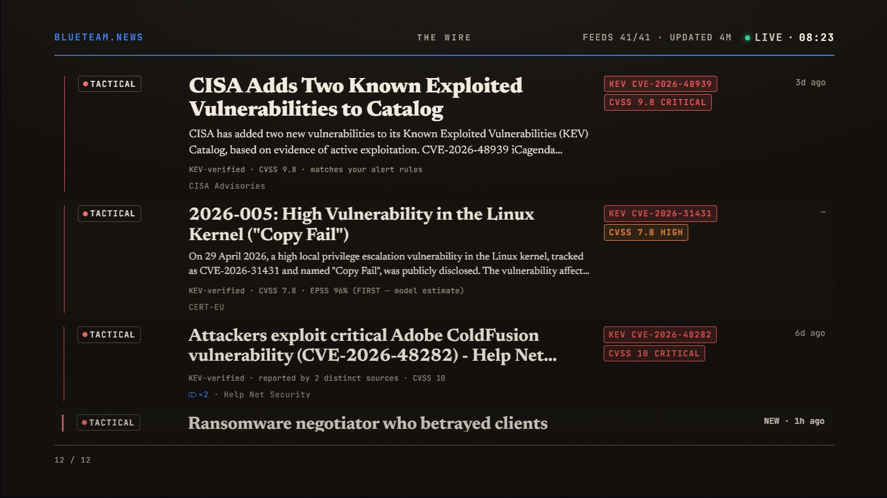
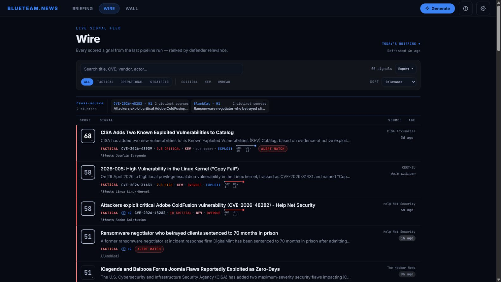
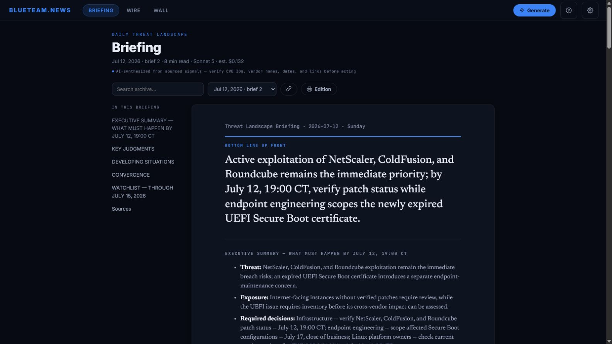

# BlueTeam.News

[](https://github.com/ryanshrier/blueteam/actions/workflows/ci.yml)
[](LICENSE)


BlueTeam.News is a self-hosted threat-intelligence desk for cyber defense teams. It collects open threat reporting, enriches and scores each signal, and presents the results in three views:

- **The Wall** — an unattended operations display
- **The Wire** — a filterable analyst feed with score evidence, KEV, CVSS, EPSS, and attribution tags
- **The Briefing** — an AI-generated daily assessment for defenders and leadership

The Wall and Wire work without API keys. The Briefing requires an Anthropic API key. Data stays in a local SQLite database, and the application sends no telemetry.

**[Quick start](#quick-start) · [The Wall](#the-wall) · [The Wire](#the-wire) · [The Briefing](#the-briefing) · [Tiers](#the-three-tiers) · [Configuration](#configuration) · [API](#api) · [Architecture](#architecture) · [Security](#security-posture) · [Development](#development)**

## Quick start

```bash
git clone https://github.com/ryanshrier/blueteam.git blueteam
cd blueteam
npm install
npm start
```

> **Node 22+ is required.** Node 22, 24, and 26 are tested in CI. There is no separate installer or bundled runtime: macOS, Windows, and Linux all use the repository and the same `npm install` / `npm start` workflow.

> **npm 11.18+ is recommended.** It enforces the repository's reviewed install-script allowlist. Older npm releases still install the application, but warn because they cannot enforce that policy; CI pins the enforcing version.

On Windows PowerShell, including PowerShell 5.1:

```powershell
git clone https://github.com/ryanshrier/blueteam.git blueteam
Set-Location blueteam
npm.cmd install
npm.cmd start
```

Using `npm.cmd` avoids execution-policy problems with the `npm.ps1` shim.

Open [http://127.0.0.1:3000](http://127.0.0.1:3000). The first feed refresh starts automatically.

To enable the Briefing:

```bash
cp .env.example .env
# Add ANTHROPIC_API_KEY=sk-ant-...
npm start
```

You can also set or verify the key in **Settings**. Each generated Briefing is billed to your Anthropic account; the application reports the model, token count, and estimated cost. See [Operations and deployment](docs/operations.md) for scheduling, runtime support, wall-display setup, and network deployment.

<a id="put-it-on-the-wall"></a>

## The Wall

The Wall is the unattended display at `/wall`. Keyless mode still shows KEV changes and scored signals; when the Briefing is enabled, each completed daily edition is adopted automatically.

Its rotation includes:

- the latest Briefing BLUF and short digest;
- individual key judgments with confidence and decision window;
- developing situations, escalation indicators, and converging signals;
- recent CISA KEV additions; and
- scored Wire rows with tier, gist, severity, age, and freshness.

Run it on the computer driving the display, then open:

```text
http://127.0.0.1:3000/wall
```

The route hides the cursor automatically. Press `Esc` to leave it.



## The Wire

The Wire at `/wire` contains every prioritized signal from the latest pipeline run and the evidence behind its score. It supports tier, urgency, KEV, and unread filters; source breadth, timestamps, CVE, CVSS, and EPSS details; attribution tags; CSV and JSON export; and shareable filter URLs such as `/wire?kev=1&sort=newest`.



## The Briefing

The Briefing at `/briefing` produces a BLUF, calibrated judgments, defensive actions, developing situations, convergence, and a 72-hour watchlist. Generation is available on demand and is scheduled for 05:00 local time.

Output streams to the browser, is validated before storage, is archived as Markdown, and is indexed in SQLite FTS5. Every edition is labeled AI-generated and includes a reminder to verify its findings before acting. Archived editions have durable URLs at `/briefing/<filename>`.



## The three tiers

Every signal is assigned to a CTI horizon used by scoring, the interface, the Wall, and the Briefing:

| Tier | Horizon | Window | Primary reader | Question |
|---|---|---|---|---|
| **T1** | Tactical | Current shift to 7 days | SOC, IR, detection | What needs attention before the next shift change? |
| **T2** | Operational | Coming weeks to 12 months | Hunt, intel, security engineering | What developing activity, capability, exposure, or policy change requires a defensive adjustment? |
| **T3** | Strategic | Beyond 12 months | Directors, CISO, board | What structural change will materially alter the threat environment, defensive model, or risk posture? |

## Documentation

| Guide | Contents |
|---|---|
| [Operations and deployment](docs/operations.md) | Installation, runtime support, wall setup, scheduling, remote access, and hardening |
| [Configuration](docs/configuration.md) | `config.json`, environment variables, organization context, alert rules, and webhooks |
| [Architecture](docs/architecture.md) | Components, collection and scoring pipeline, Briefing flow, storage, and CTI profile boundary |
| [API](docs/api.md) | REST, SSE, RSS/JSON feeds, authentication, and embedding |
| [Development](docs/development.md) | Tests, release checks, repository layout, and keyboard shortcuts |
| [Security policy](SECURITY.md) | Supported versions, private vulnerability reporting, scope, and deployment hardening |

The project website is [blueteam.news](https://blueteam.news/).

<a id="alert-webhook-optional"></a>
<a id="environment-variables"></a>

## Configuration

`config.json` controls feeds, alert rules, organization context, scoring, models, and refresh cadence. It is validated and hot-reloaded when saved. Runtime secrets and server settings use environment variables.

See the [Configuration guide](docs/configuration.md) for the complete reference and webhook examples.

## API

BlueTeam.News exposes the landscape, headlines, Briefing history and generation, search, health, settings, RSS, and JSON feeds under `/api`. Generation uses a server-sent events stream. An optional bearer token protects every API route except `/api/health`, which remains available to uptime probes; a valid optional token unlocks its detailed diagnostics.

See the [API reference](docs/api.md) for endpoints and deployment behavior.

<a id="internal-cti-profile-boundary"></a>

## Architecture

The application is an Express server with a vanilla JavaScript frontend and no frontend build step. It collects and enriches feeds, scores signals with inspectable evidence, stores rolling results and Briefings in SQLite, and serves the Wall, Wire, and Briefing over REST and SSE.

See [Architecture](docs/architecture.md) for the pipeline and module boundaries.

## Development

```bash
npm test
npm run check:secrets
npm run check:cti-scope
npm run check:assets
```

The [Development guide](docs/development.md) lists all checks and maps the repository.

## Security posture

- Binds to `127.0.0.1` by default, validates browser Host and Origin boundaries, and refuses a non-loopback bind without a strong `API_SECRET`
- Uses a nonce-based Content Security Policy; rendering libraries and fonts are self-hosted, with no runtime CDN or Google asset requests
- Sanitizes rendered Briefing Markdown
- Applies API rate limits, with a stricter generation limit, and SSRF protection to outbound requests
- Sends no telemetry

Expected outbound traffic is limited to configured feeds and enrichment sources, Anthropic when Briefing generation is enabled, and an operator-configured webhook. The [operations guide](docs/operations.md#health-and-outbound-traffic) lists the data sent to each optional destination. See [SECURITY.md](SECURITY.md) for hardening guidance and private vulnerability reporting.

## FAQ

**Does it require an Anthropic key?** No. Collection, scoring, the Wall, and the Wire work without one. The key enables the AI-generated Briefing.

**Is there a desktop or macOS installer?** No. Clone the repository, run `npm install`, then run `npm start` on any supported operating system.

**Can I change the feeds?** Yes. Edit `trustedFeeds` in `config.json`, including each source's tier and weight.

**Why use a broadsheet layout?** It favors readable judgments and evidence over animated attack-map traffic.

**Where do actor attributions come from?** From a small static map of publicly attributed groups in `config/domains/cyber.js`.

**Why does it bind only to localhost by default?** The intended deployment runs on the machine driving the display. Network exposure is an explicit opt-in requiring `API_SECRET`; use a reverse proxy and TLS for remote access.

## Governance and support

BlueTeam.News is maintainer-led. Unsolicited pull requests and feature requests are not accepted; forks are welcome under the MIT License. Focused bug reports may be opened, but there is no support commitment, response-time guarantee, maintenance schedule, roadmap, or promise of a fix.

See [CONTRIBUTING.md](CONTRIBUTING.md), [SUPPORT.md](SUPPORT.md), and [SECURITY.md](SECURITY.md).

## License

[MIT](LICENSE). Bundled fonts remain under the SIL Open Font License; see [THIRD_PARTY_NOTICES.md](THIRD_PARTY_NOTICES.md).
