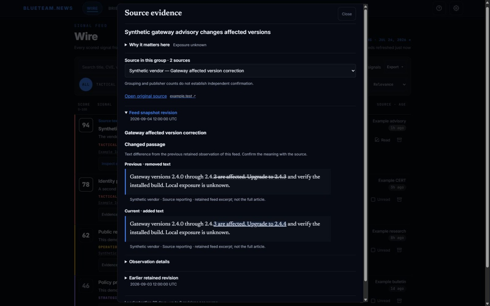

# BlueTeam.News

[](https://github.com/ryanshrier/blueteam/actions/workflows/ci.yml)
[](LICENSE)


**Version 1.1.0.** See [release notes and upgrade guidance](https://github.com/ryanshrier/blueteam/releases/tag/v1.1.0).

BlueTeam.News is a self-hosted threat-intelligence desk for cyber defense teams. It collects public threat reporting, enriches and scores each signal, and presents it in three views:

- **The Wall** - an automatic display for an unattended operations TV
- **The Wire** - a filterable analyst feed with score evidence, KEV, CVSS, EPSS, and attribution tags
- **The Briefing** - an AI-generated, on-demand or scheduled assessment that requires an operator-provided Anthropic API key; each saved Briefing can be opened as a locally rendered Print Edition for paper or PDF

The Wall and Wire work without API keys. The complete Watch–Investigate–Brief workflow requires an Anthropic API key for Briefing generation.

## Quick start

Install Node 22.19 or newer in the Node 22 line, Node 24, or Node 26 first, and
use the npm bundled with it. This is a source-installed Node service.

```bash
git clone https://github.com/ryanshrier/blueteam.git blueteam
cd blueteam
npm install
npm start
```

Open [http://127.0.0.1:3000](http://127.0.0.1:3000). The first feed refresh begins
after startup; Wire fills as sources respond, without an API key. Check
**Settings → System health** if collection remains unavailable. A Briefing may
wait for enough fresh source evidence even when an Anthropic key is configured.

SQLite uses a native dependency. Run `npm install` on the machine and Node major
that will run the service; do not copy `node_modules` from another installation.
After changing Node majors, stop the server and reinstall dependencies in that
clone. See [native-binding troubleshooting](docs/operations.md#troubleshooting)
if installation or startup reports an ABI error. CI exercises Linux, Windows,
and both Intel and Apple Silicon macOS.

In Windows PowerShell, use `npm.cmd install` and `npm.cmd start` if execution policy blocks the `npm.ps1` shim.

## Product views

### The Wall

Select **WALL** in the app, press `G` then `L`, or open `/wall` to start the automatic TV loop across the full viewport. It has no visible navigation controls or setup step. Press `Esc` to return to the prior app view.

Configure text size, margins, playback, fullscreen, and supported screen-awake behavior in **Settings → Wall display**. When enabled, clicking **WALL** or using its keyboard shortcut attempts browser fullscreen without delaying navigation. Opening or reloading a Wall URL does not request fullscreen; the display still fills the viewport when fullscreen is unavailable or declined.

The Wall rotates through current signals and CISA KEV changes and includes the latest eligible saved Briefing when available. Long sections continue across readable parts before advancing. The hidden pointer, overnight dimming, and burn-in shifting support unattended use. Editions marked review-required or superseded are excluded from default selection. Feed freshness and Briefing publication time remain separate; an older Briefing does not become current when its page rotates back into view. Publication times use UTC; archives without a known time show their edition date.


### The Wire

Open `/wire` to inspect every prioritized signal and the evidence behind its score. Filters cover tier, urgency, KEV status, and unread state. Results include source breadth, timestamps, CVE, CVSS, EPSS, attribution tags, and CSV or JSON export.

Use **Hidden (N)** to recover signals you hid, including after a reload or after Undo disappears. Restore one signal or all hidden signals still available in the latest feed. Filters also apply in Hidden; restoring preserves read/unread state. These preferences belong to this browser and do not record operational completion.

The inspector's **Decision record** stores your assessment, owner, next review date, basis, and evidence reference in this browser. States include **Investigating**, **Affected**, **Not affected**, and **Mitigated**. Exports include the saved record for handoff; it is not synchronized with a team or verified against an asset inventory.

Set a **Watch profile** in Settings: technologies, sectors, regions, intelligence
questions, exclusions and preferred horizons. Wire explains literal matches and
keeps exposure explicitly unknown. **Inspect evidence** opens each grouped
source's retained feed excerpt, observation dates and earlier revisions; changed
passages appear together with the original wording. Collection after this upgrade
creates that history. **Retained source changed** compares the retained title,
passage, or capture metadata with its predecessor, not with the analyst's last
review. **More source context retained** identifies an expanded capture; it does
not establish a publisher correction or a change in the threat.

For example, watch a product, inspect its retained advisory, and compare a
later affected-version change. A watch match explains why reporting is relevant;
it does not establish that the product is deployed or exposed in your network.


**Inspect evidence** keeps the source name, observation dates, and retained
passages together. Open the captured source text and available revision history
without losing the selected signal. Local exposure remains unknown until checked.



### The Briefing

Open `/briefing` to generate a BLUF, key judgments, defensive actions, developing situations, convergence, and a 72-hour watchlist. Briefing generation requires your Anthropic API key, configured in **Settings** or `.env`. Key verification makes a minimal provider request and may consume billable tokens.

Saved editions open in **Overview**, with a lead assessment, supporting briefs, and a separately timed stream of recent reporting. **Decision summary** collects the authored actions, owners, and timing. **Full report** retains the complete assessment and source trail. The selected reading mode is remembered. Sources, assessment update time, severity, and confidence use consistent labels; fields absent from the saved edition remain explicitly unavailable or unassessed. Legacy likelihood labels remain likelihood.

**Edition tools** groups history, copy, Print Edition, saved inputs, and generation. **Generate briefing** and `Ctrl+Enter` (`⌘+Enter` on macOS) use the latest collection selection. Wire searches, filters, and hidden items do not select or exclude its inputs. Judgment reasoning remains visible alongside its qualitative confidence label. Links into Wire say whether they search a CVE or browse a broader tier; they are not a historical evidence manifest.

On a saved judgment with authored actions, **Copy decision** copies the action text, supplied ownership and timing, cited source links, and an edition link for a handoff. This reuses saved content without another model call. Check the cited reporting and the edition date before acting.

New editions also retain a versioned JSON generation input receipt. **Sources
and saved inputs**, inside **Edition tools**, opens a readable view of selected
evidence, enrichment, profile, scoring settings, prompt/model identities, and
validation used for that edition; an advanced disclosure provides the JSON.
Historical editions without receipts say so. Receipts may contain organizational
context and are available only through the trusted operator connection.
They record what was supplied and checked; they do not independently prove
every claim, verify local exposure, or replace review of the cited reporting.

**Drafts** opens retained rejected or interrupted output when a draft was
available to save. Repairing and rechecking a revision uses its captured inputs
without another model call and does not publish it. Source-check results and
editorial review status are shown separately. Reviewed copies and publication
dispositions are tied to the exact original edition; the original Markdown and
input receipt remain unchanged.

Read [Evidence and relevance](docs/evidence-and-relevance.md) for usage, retention
and limitations. The [decision-desk roadmap](docs/decision-desk-roadmap.md)
describes proposed priorities beyond these local records: persistent situations,
explicit input selection, and shared handoff acknowledgment and completion.
Those shared workflows are not implemented, and no delivery schedule is promised.

Automatic generation is a separate opt-in and is disabled by default. Settings controls whether it runs, the time and timezone, missed-run behavior, retry interval, and daily attempt limit. Manual and automatic generation use the same pipeline and are billed to the configured Anthropic account; corrective or fallback model calls can add usage.

Before a generation is archived as complete, BlueTeam.News checks required decision fields, citation identities and dates, incomplete provider output, and specified CVE, CVSS, version, and KEV claim forms. Other checks remain visible as review warnings. These bounded checks do not establish that all freeform narrative follows from the sources or confirm organizational exposure. Completed Briefings are labeled AI-generated, archived as Markdown, and normally indexed in SQLite FTS5. The interface shows the model, token count, estimated cost, and review warnings; an indexing failure is reported and retried during startup reconciliation.

**One Briefing. Two formats.** After a Briefing completes, review it in the application or open its **Print Edition**, an editorial layout for paper or PDF rendered locally from the same saved assessment without another model request.

| Briefing | Print Edition |
|---|---|
|  |  |

Read the [complete synthetic sample](docs/sample-briefing.html), its exact
[Markdown](docs/sample-briefing.md), and the [saved input receipt](docs/sample-briefing.manifest.json).
The [PDF companion](docs/sample-briefing.pdf) is rendered from the complete public sample using the current Print Edition styles, including its source appendix and receipt.

Product screenshots show collected public reporting and the editorially corrected
September 6 edition 2, with its review status preserved. They illustrate the
product at capture time, not a current security assessment. The downloadable
fictional sample remains a separate, reproducible demonstration.

### Settings and diagnostics

**Settings → System health** shows the latest readiness check, collection status, source failures, and available storage diagnostics. **Refresh diagnostics** checks again without starting collection or generation. A failed check retains a clearly dated previous result. **Copy diagnostics** copies a limited report without source names, URLs, secrets, organization settings, or raw error messages; it does not send anything to support.

## How it works

```text
public feeds and advisories
          |
     collect and group
          |
 enrich, score, and retain evidence
          |
  Wall | Wire | AI-generated Briefing
                  (Anthropic API key)
```

Each signal is assigned to an analytic tier. A generated Briefing separately
states the operator's decision window for each key judgment.

| Tier | Analytic horizon | Window | Primary reader |
|---|---|---|---|
| **T1** | Tactical | Current shift to 7 days | SOC, IR, detection |
| **T2** | Operational | Coming weeks to 12 months | Hunt, intelligence, security engineering |
| **T3** | Strategic | Beyond 12 months | Directors, CISO, board |

Source diversity records the distinct publisher identities inferred from article domains and source labels across feeds and news search. It does not prove that the reporting is independent. Score components remain visible in the interface.

## Local data and network behavior

Operational state is stored in `data/watchfloor.db`, saved Briefings in `briefs/*.md`, and operator settings in the gitignored `data/settings.local.json`. BlueTeam.News does not encrypt local state, so protect the host account and backups.

The self-hosted application sends no product telemetry. It does make outbound requests to:

- configured feeds, article pages, and enrichment sources;
- Anthropic when key verification or Briefing generation is requested; and
- an operator-configured webhook.

Briefing requests include selected public-source evidence and configured organization context. See [Operations and deployment](docs/operations.md#network-behavior) for the exact boundary.

Feed, article, and enrichment requests identify BlueTeam.News and its version through a configurable User-Agent; set `BLUETEAM_USER_AGENT` when an operator contact identity is preferred.

The server binds to `127.0.0.1` by default. Network deployment requires a strong `API_SECRET`; remote interactive use also requires an authenticating TLS reverse proxy that injects the bearer token upstream.

## Documentation

| Guide | Contents |
|---|---|
| [Operations and deployment](docs/operations.md) | Runtime support, scheduling and cost, backups, upgrades, supervision, logs, troubleshooting, and remote access |
| [Configuration](docs/configuration.md) | `config.json`, runtime Settings, environment variables, organization context, and webhooks |
| [Architecture](docs/architecture.md) | Collection, scoring, Briefing generation, storage, and module boundaries |
| [API overview](docs/api.md) | REST, SSE, RSS and JSON feeds, authentication, and embedding |
| [Development](docs/development.md) | Tests, policy checks, release checks, and repository layout |
| [Security policy](SECURITY.md) | Deployment model, supported versions, scope, and private reporting |

The project website is [blueteam.news](https://blueteam.news/), and published versions are listed on [GitHub Releases](https://github.com/ryanshrier/blueteam/releases).

## Development

```bash
npm test
npm run check:release
npm run check:secrets
npm run check:cti-scope
npm run check:assets
```

`npm run check:design:render` checks the editorial overview, reading transitions, Wire tools, mobile fit, and both themes against read-only synthetic data in an isolated Chromium browser. `check:evidence:render` exercises the inspector; `check:handoff:render` verifies real CSV/JSON downloads and PDF content and pagination. The PDF check requires Poppler; hosts without `pdftotext` can explicitly set `HANDOFF_PYTHON` to a Python runtime with `pdfplumber` for text and word-bound extraction.

The policy job uses a pinned npm version to enforce the reviewed dependency lifecycle-script allowlist. Runtime jobs deliberately use the npm bundled with each supported Node version so the documented run-from-source workflow stays tested.

## Security, support, and license

Read [SECURITY.md](SECURITY.md) before exposing the service beyond loopback and use GitHub private vulnerability reporting for security issues. The project is maintainer-led and provided without a support or update commitment; see [SUPPORT.md](SUPPORT.md) and [CONTRIBUTING.md](CONTRIBUTING.md).

BlueTeam.News is available under the [MIT License](LICENSE). Bundled fonts remain under the SIL Open Font License; see [THIRD_PARTY_NOTICES.md](THIRD_PARTY_NOTICES.md).
