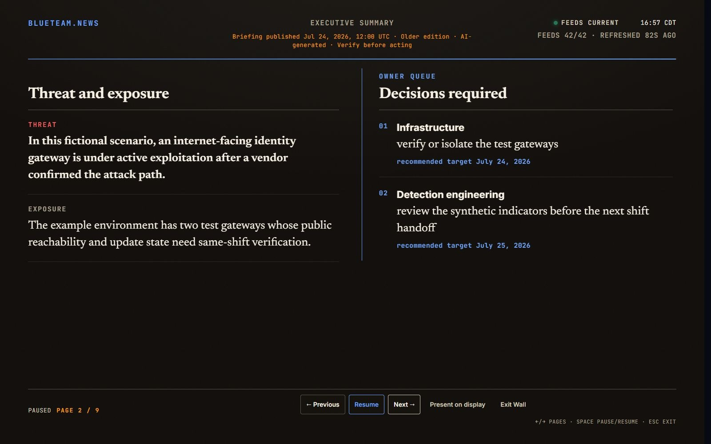
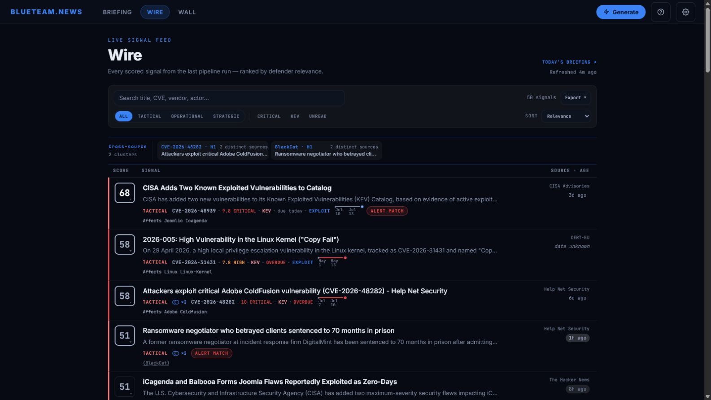
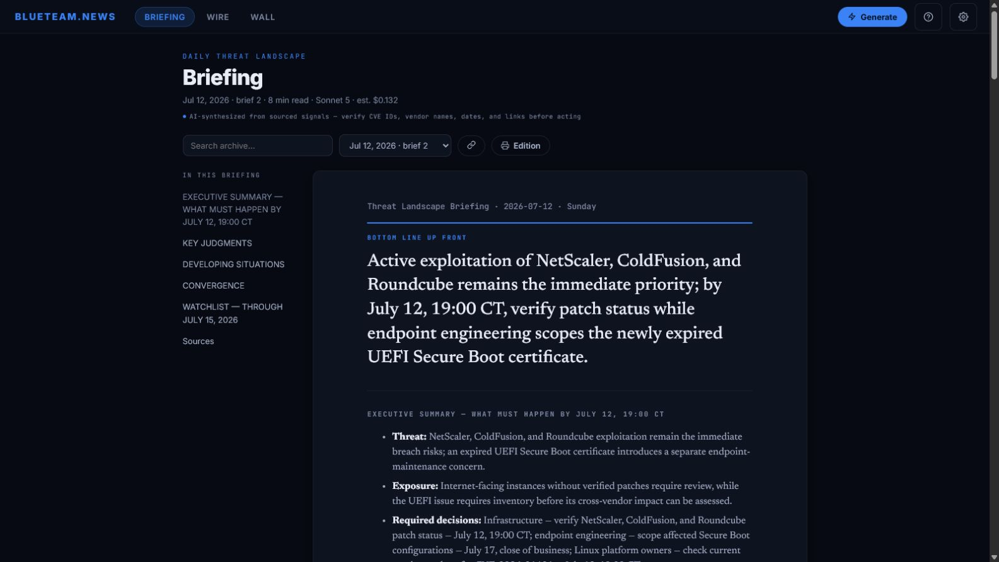

# BlueTeam.News

[](https://github.com/ryanshrier/blueteam/actions/workflows/ci.yml)
[](LICENSE)


BlueTeam.News is a self-hosted threat-intelligence desk for cyber defense teams. It collects public threat reporting, enriches and scores each signal, and presents it in three views:

- **The Wall** - an unattended operations display
- **The Wire** - a filterable analyst feed with score evidence, KEV, CVSS, EPSS, and attribution tags
- **The Briefing** - an optional Anthropic-generated daily assessment

The Wall and Wire work without API keys.

## Quick start

```bash
git clone https://github.com/ryanshrier/blueteam.git blueteam
cd blueteam
npm install
npm start
```

Open [http://127.0.0.1:3000](http://127.0.0.1:3000). The first feed refresh begins after startup.

Node 22.19 or newer in the Node 22 line, Node 24, and Node 26 are supported; use the npm version bundled with that Node release. Linux, macOS, and Windows use the same source workflow above.

In Windows PowerShell, use `npm.cmd install` and `npm.cmd start` if execution policy blocks the `npm.ps1` shim.

## Product views

### The Wall

Open `/wall` on the display driven by the server. It rotates through current signals and CISA KEV changes, and includes the latest saved Briefing when one is available. Press `Esc` to leave the display.



### The Wire

Open `/wire` to inspect every prioritized signal and the evidence behind its score. Filters cover tier, urgency, KEV status, and unread state. Results include source breadth, timestamps, CVE, CVSS, EPSS, attribution tags, and CSV or JSON export.



### The Briefing

Open `/briefing` to generate a BLUF, key judgments, defensive actions, developing situations, convergence, and a 72-hour watchlist. Add an Anthropic API key in **Settings** or `.env` to enable generation.

Automatic generation is disabled by default. Settings controls whether it runs, the time and timezone, missed-run behavior, retry interval, and daily attempt limit. Manual and automatic generation use the same pipeline and are billed to the configured Anthropic account; corrective or fallback model calls can add usage.

Generated text is checked for required structure and source constraints before publication. Those checks are not a guarantee of factual correctness. Published editions are labeled AI-generated, archived as Markdown, and normally indexed in SQLite FTS5. The interface shows the model, token count, estimated cost, and any review warnings; an indexing failure is reported and retried during startup reconciliation.



## How it works

```text
public feeds and advisories
          |
     collect and group
          |
 enrich, score, and retain evidence
          |
  Wall | Wire | optional Briefing
```

Each signal is assigned to a decision horizon:

| Tier | Horizon | Window | Primary reader |
|---|---|---|---|
| **T1** | Tactical | Current shift to 7 days | SOC, IR, detection |
| **T2** | Operational | Coming weeks to 12 months | Hunt, intelligence, security engineering |
| **T3** | Strategic | Beyond 12 months | Directors, CISO, board |

Source diversity records the distinct publisher identities inferred from article domains and source labels across feeds and news search. It does not prove that the reporting is independent. Score components remain visible in the interface.

## Local data and network behavior

Operational state is stored in `data/watchfloor.db`, saved Briefings in `briefs/*.md`, and operator settings in the gitignored `data/settings.local.json`. BlueTeam.News does not encrypt local state, so protect the host account and backups.

The self-hosted application sends no product telemetry. It does make outbound requests to:

- configured feeds, article pages, and enrichment sources;
- Anthropic when key verification or Briefing generation is requested; and
- an operator-configured webhook.

Briefing requests include selected public-source evidence and configured organization context. See [Operations and deployment](docs/operations.md#network-behavior) for the exact boundary.

The server binds to `127.0.0.1` by default. Network deployment requires a strong `API_SECRET`; remote interactive use also requires an authenticating TLS reverse proxy that injects the bearer token upstream.

## Documentation

| Guide | Contents |
|---|---|
| [Operations and deployment](docs/operations.md) | Runtime support, scheduling and cost, backups, upgrades, supervision, logs, troubleshooting, and remote access |
| [Configuration](docs/configuration.md) | `config.json`, runtime Settings, environment variables, organization context, and webhooks |
| [Architecture](docs/architecture.md) | Collection, scoring, Briefing generation, storage, and module boundaries |
| [API overview](docs/api.md) | REST, SSE, RSS and JSON feeds, authentication, and embedding |
| [Development](docs/development.md) | Tests, policy checks, release checks, and repository layout |
| [Security policy](SECURITY.md) | Deployment model, supported versions, scope, and private reporting |

The project website is [blueteam.news](https://blueteam.news/), and published versions are listed on [GitHub Releases](https://github.com/ryanshrier/blueteam/releases).

## Development

```bash
npm test
npm run check:release
npm run check:secrets
npm run check:cti-scope
npm run check:assets
```

The policy job uses a pinned npm version to enforce the reviewed dependency lifecycle-script allowlist. Runtime jobs deliberately use the npm bundled with each supported Node version so the documented install path stays tested.

## Security, support, and license

Read [SECURITY.md](SECURITY.md) before exposing the service beyond loopback and use GitHub private vulnerability reporting for security issues. The project is maintainer-led and provided without a support or update commitment; see [SUPPORT.md](SUPPORT.md) and [CONTRIBUTING.md](CONTRIBUTING.md).

BlueTeam.News is available under the [MIT License](LICENSE). Bundled fonts remain under the SIL Open Font License; see [THIRD_PARTY_NOTICES.md](THIRD_PARTY_NOTICES.md).
