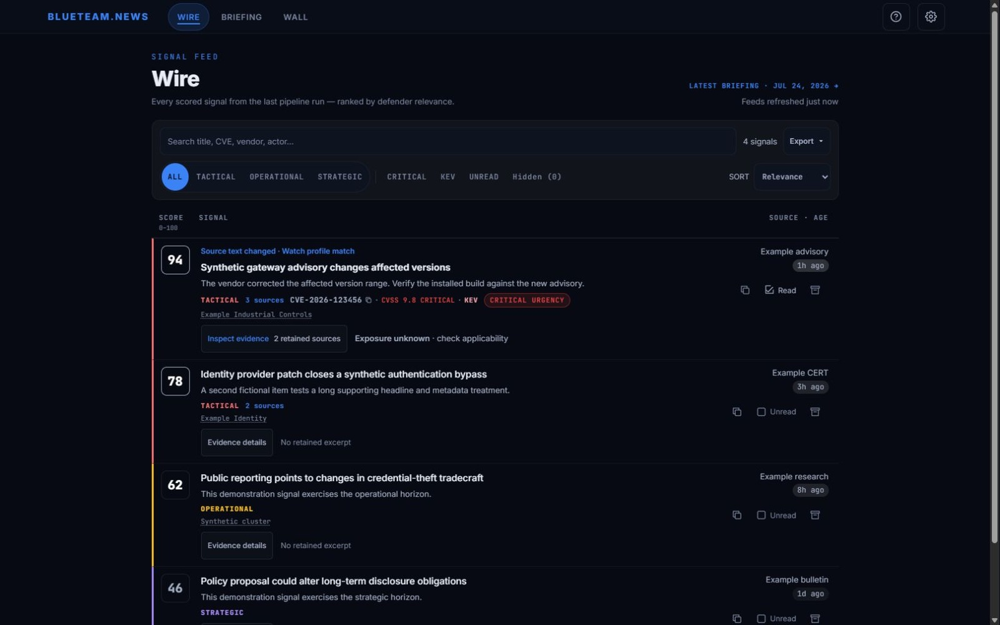
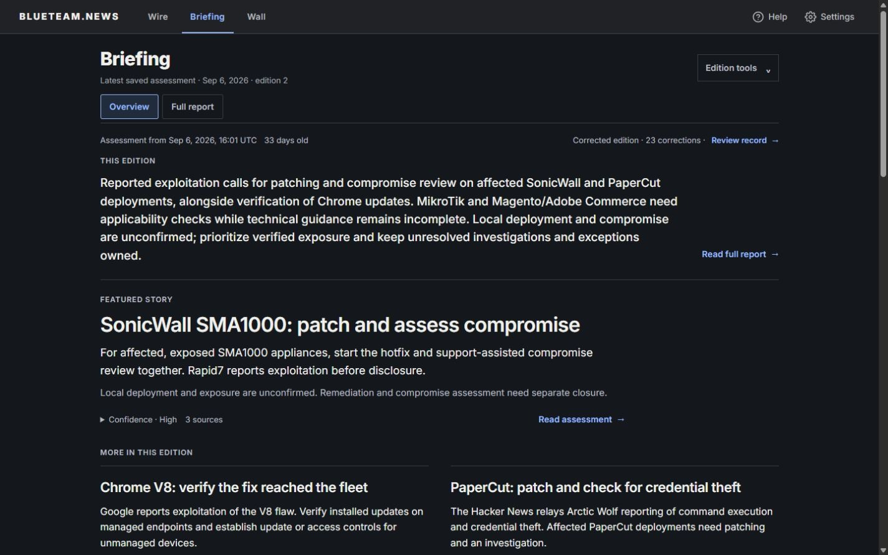
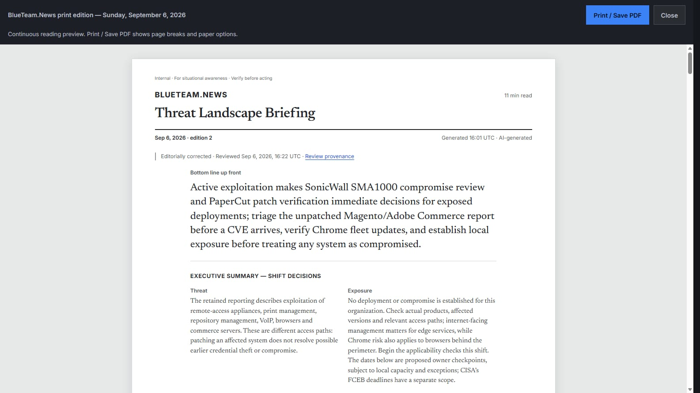

# BlueTeam.News

[](https://github.com/ryanshrier/blueteam/actions/workflows/ci.yml)
[](LICENSE)


BlueTeam.News is a self-hosted threat-intelligence desk. It collects public reporting, groups related stories, and scores signals with KEV, CVSS, EPSS, source, and freshness evidence.

- **Wall:** an automatic display for an operations TV.
- **Wire:** a filterable analyst feed with retained source passages, revision comparisons, local decision records, and exports.
- **Briefing:** an AI-generated assessment using your Anthropic or OpenAI API key, with saved inputs and a Print Edition for paper or PDF. OpenAI supports Codex models through the Responses API.

Wall and Wire work without API keys. Briefing generation may incur provider charges; built-in provider key verification makes a small billable request.



## Quick start

Recommended: Node.js 24 with npm. See the full supported ranges in [Operations](docs/operations.md#runtime-support) and [Development](docs/development.md).

```bash
git clone --branch v1.3.2 --single-branch https://github.com/ryanshrier/blueteam.git blueteam
cd blueteam
npm install
npm start
```

Open [http://127.0.0.1:3000](http://127.0.0.1:3000). Collection starts automatically; Wire fills as sources respond. **Settings → System health** shows readiness and source failures.

Install dependencies on the machine and Node major that will run the service. SQLite has a native dependency, so reinstall after changing Node majors; do not copy `node_modules` between installations. See [troubleshooting](docs/operations.md#troubleshooting) for native-binding errors. In Windows PowerShell, use `npm.cmd` if execution policy blocks the `npm.ps1` shim.

## Configure Briefing generation

In **Settings**, choose **Anthropic** or **OpenAI (Codex)**, enter that provider's API key, and save. Both built-in provider keys can be stored so you can switch providers. For OpenAI, select a model available to your API account; the default is `gpt-5.3-codex`. Verify makes a small billable request to test the key; OpenAI verification also checks the selected model.

**Custom (local module) is experimental.** Set `AI_PROVIDER_MODULE=./local/generic-provider.js` to load an operator-supplied adapter; its contract may change. Modules run trusted code with the server's permissions and read credentials from the environment. Settings provides an optional module health check instead of key verification. See the [local provider contract](docs/configuration.md#local-provider-modules).

You can also copy `.env.example` to `.env` and set one provider:

```dotenv
# OpenAI Codex
AI_PROVIDER=openai
OPENAI_API_KEY=
OPENAI_MODEL=gpt-5.3-codex
```

```dotenv
# Anthropic
AI_PROVIDER=anthropic
ANTHROPIC_API_KEY=
```

Enter your key after `=`. Environment keys override saved keys for the same provider. OpenAI generation calls the Responses API directly; it requires an OpenAI API key and does not use a Codex CLI or ChatGPT subscription login. See [Configuration](docs/configuration.md) for provider selection, model settings, and precedence.

Open **Briefing → Edition tools → Generate briefing**. Generation waits for enough fresh source evidence. Wire searches, filters, and hidden items do not change its input selection.

Automatic generation is off by default. Enable it separately in Settings and choose a time, timezone, and retry policy. Manual and scheduled runs use the selected provider and the same validation and storage pipeline. Retries can add cost; application limits are not a provider spending cap.

## Using the views

**Wall** (`/wall`) rotates through signals, KEV changes, and the latest eligible saved Briefing. Press `G`, then `L` to enter and `Esc` to leave. Settings controls size, margins, playback, fullscreen, and supported screen-awake behavior. Feed freshness and Briefing publication time are shown separately.

**Wire** (`/wire`) exposes score components and filters for tier, urgency, KEV, and unread state. **Inspect evidence** shows retained passages and changes between observations. A watch profile explains literal matches to your technologies, sectors, and regions; local exposure remains unknown. Read state follows retained revisions, so changed evidence becomes unread again. Decisions and hidden/read preferences stay in this browser and update across its tabs. CSV and JSON exports cover current results; **Export all saved decisions (JSON)** also includes decisions for hidden, filtered, and older signals.

**Briefing** (`/briefing`) opens published editions in Overview or Full report. Overview presents featured and supporting stories as a news front page; Full report contains the complete analysis, actions, timing, and citations. Ordinary generation publishes automatically, including routine editorial notes. Serious findings retain an unpublished draft while Latest and Wall keep the current briefing. In **Edition tools → Drafts**, **Save draft** preserves edits; **Publish briefing** checks and publishes them without another model call. New editions retain the evidence, configuration, provider/model attempts, and validation used to generate them. Historical editions may lack these receipts. Draft repair and reviewed copies preserve the original evidence and edition date.

Published editions keep relevant conditions beside their assessments and collect checks, scoped approvals, and correction history in **Edition record**. Routine editorial notes do not create a distribution warning. Copied decisions and print preserve the applicable qualifications and sources, with a link back to the saved edition.

Review generated claims against their cited reporting. Publication checks cover structure, citation identities and dates, incomplete provider output, and specified CVE, CVSS, version, and KEV claim forms. They do not verify every narrative claim or confirm your organization's exposure.

The Print Edition renders the same saved assessment locally without another model request.

| Briefing | Print Edition |
|---|---|
|  |  |

Read the [fictional sample](https://blueteam.news/sample-briefing.html), [Markdown](docs/sample-briefing.md), [input receipt](docs/sample-briefing.manifest.json), or [PDF](docs/sample-briefing.pdf). The Overview screenshot was refreshed October 9, 2026; the other embedded screenshots were captured September 6, 2026. They show collected reporting and the reviewed September 6 edition 2, not a current assessment.

See [Evidence and relevance](docs/evidence-and-relevance.md) for retention rules, review states, and limitations. Shared situation tracking and handoff acknowledgment remain [proposed work](docs/decision-desk-roadmap.md).

## Data and deployment

The server binds to `127.0.0.1` by default. Remote interactive access requires a strong `API_SECRET` and an authenticating TLS reverse proxy that injects the bearer token upstream. See [Operations and deployment](docs/operations.md).

Local state lives in `data/watchfloor.db`, saved assessments and input receipts in `briefs/`, editorial corrections and publication decisions in `reviews/`, and operator settings in the gitignored `data/settings.local.json`. Back up these together. Saved API keys are masked in responses but stored in plaintext. Protect the host account and backups.

There is no product telemetry. Outbound requests go to configured feeds and enrichment sources, the selected AI provider during verification or generation, and an optional configured webhook. Generation sends selected source evidence and configured organization context. The [network boundary](docs/operations.md#network-behavior) lists the supplied data.

## Documentation

| Guide | Contents |
|---|---|
| [Operations and deployment](docs/operations.md) | Runtime support, scheduling, cost, backups, upgrades, troubleshooting, and remote access |
| [Configuration](docs/configuration.md) | Settings, provider keys/models, environment variables, feeds, and webhooks |
| [Evidence and relevance](docs/evidence-and-relevance.md) | Source retention, watch profiles, decision records, and assessment review |
| [Architecture](docs/architecture.md) | Collection, scoring, generation, storage, and module boundaries |
| [API overview](docs/api.md) | REST, SSE, feeds, authentication, and embedding |
| [Development](docs/development.md) | Tests, browser checks, release checks, and repository layout |
| [Security policy](SECURITY.md) | Deployment model and private vulnerability reporting |

The project website is [blueteam.news](https://blueteam.news/). Published versions and upgrade notes are on [GitHub Releases](https://github.com/ryanshrier/blueteam/releases); pending changes are in the [changelog](CHANGELOG.md).

## Development

```bash
npm test
npm run check:release
npm run check:secrets
npm run check:cti-scope
npm run check:assets
```

The [development guide](docs/development.md) lists focused browser, evidence, export, and generation checks. Tests use synthetic inputs; routine verification does not require paid generation.

## Support and license

BlueTeam.News is maintainer-led and provided without a support or update commitment. See [SUPPORT.md](SUPPORT.md) and [CONTRIBUTING.md](CONTRIBUTING.md). Report vulnerabilities privately through [SECURITY.md](SECURITY.md).

Code is available under the [MIT License](LICENSE). Bundled fonts use the SIL Open Font License; see [THIRD_PARTY_NOTICES.md](THIRD_PARTY_NOTICES.md).
